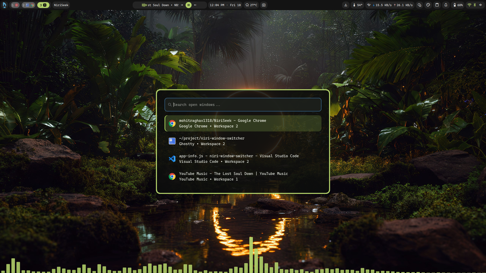

# NiriSeek

A fast, keyboard-first window switcher built specifically for the Niri Wayland compositor.

NiriSeek gives you a searchable GTK4 interface for jumping between open windows across Niri workspaces.

Press `Mod + Tab`, search, select, and jump.

---

## Preview




---

## Features

- Native GTK4 interface
- Built with JavaScript and GJS
- Direct Niri IPC integration
- Search windows by title
- Search windows by application ID
- Keyboard-first navigation
- Mouse row activation
- Cross-workspace window focusing
- MRU-style recent-window sorting
- Currently focused window deprioritization
- Automatic application icon resolution
- Human-readable application names
- Workspace information
- Custom dark transparent GTK theme
- Floating window integration with Niri
- Fresh state on repeated launch
- Portable installation script
- No Electron
- No frontend framework
- No runtime npm dependencies

---

## Keyboard Controls

| Key | Action |
| --- | --- |
| `Mod + Tab` | Open or relaunch NiriSeek |
| `↑` | Select previous window |
| `↓` | Select next window |
| `Enter` | Focus selected window |
| `Esc` | Close NiriSeek |
| Type | Filter open windows |

Mouse row activation is also supported.

---

## Tested Environment

NiriSeek is currently tested with:

```text
Niri Compositor: 26.04
Niri CLI:        26.04
GTK4:            4.22.4
GJS:             1.88.0
Display Server:  Wayland
```

Other Niri versions may work, but are not currently verified.

---

## Requirements

You need:

- Niri
- GJS
- GTK4
- Git

NiriSeek must run inside an active Niri session because it communicates with the compositor using `niri msg`.

---

## Installation

### 1. Install dependencies

#### Ubuntu / Debian-based systems

```bash
sudo apt update
sudo apt install -y git gjs libgtk-4-1
```

#### Arch Linux

```bash
sudo pacman -S git gjs gtk4
```

#### Fedora

```bash
sudo dnf install git gjs gtk4
```

Package names may vary slightly depending on your distribution.

Verify the required tools:

```bash
gjs --version
gtk4-launch --version
niri msg version
```

---

### 2. Clone NiriSeek

```bash
git clone https://github.com/mohitraghav1318/NiriSeek.git
cd niriseek
```


---

### 3. Run the installer

Make the installer executable:

```bash
chmod +x scripts/install.sh
```

Run it:

```bash
./scripts/install.sh
```

The installer creates:

```text
~/.local/bin/niriseek
```

It also prints the Niri configuration required to launch NiriSeek.

Verify the command:

```bash
command -v niriseek
```

Expected output:

```text
/home/your-user/.local/bin/niriseek
```

---

## Niri Configuration

Add the following to your Niri configuration:

```kdl
binds {
    Mod+Tab {
        spawn "niriseek"
    }
}

window-rule {
    match app-id="dev.mohit.NiriSeek"
    open-floating true
}
```

Then validate your configuration:

```bash
niri validate
```

Reload Niri:

```bash
niri msg action load-config-file
```

Now press:

```text
Mod + Tab
```

NiriSeek should open as a floating window.

---

## Recommended: Separate Config File

If your Niri configuration is split across multiple files, you can keep NiriSeek isolated.

Create a custom directory:

```bash
mkdir -p ~/.config/niri/custom
```

Create:

```text
~/.config/niri/custom/niriseek.kdl
```

Add:

```kdl
binds {
    Mod+Tab {
        spawn "niriseek"
    }
}

window-rule {
    match app-id="dev.mohit.NiriSeek"
    open-floating true
}
```

Then include it from your main Niri config:

```kdl
include "custom/niriseek.kdl"
```

Validate and reload:

```bash
niri validate
niri msg action load-config-file
```

---

## Existing `Mod + Tab` Conflicts

Your Niri setup may already use `Mod + Tab`.

Search your configuration:

```bash
grep -Rni "Mod+Tab" ~/.config/niri
```

Also check for Niri's recent-window configuration:

```bash
grep -Rni "recent-windows" ~/.config/niri
```

If another binding already uses `Mod + Tab`, remove it or choose a different shortcut for NiriSeek.

For example:

```kdl
binds {
    Mod+Space {
        spawn "niriseek"
    }
}
```

Use any shortcut that does not conflict with your existing setup.

---

## Running Manually

You can launch the installed command directly:

```bash
niriseek
```

You can also run NiriSeek from the repository:

```bash
./scripts/launch.sh
```

Or run the GJS entry point directly:

```bash
gjs -m src/gui/main.js
```

---

## How It Works

NiriSeek communicates with Niri through its CLI IPC interface.

The basic flow is:

```text
Niri compositor
      ↓
niri msg --json windows
      ↓
Read open window metadata
      ↓
Sort by recent focus history
      ↓
Deprioritize current window
      ↓
Render GTK4 window list
      ↓
Search / navigate
      ↓
Select window
      ↓
niri msg action focus-window --id <window-id>
```

Niri exposes window metadata including:

- Window ID
- Title
- Application ID
- Workspace ID
- Focus state
- Focus timestamp

NiriSeek uses this data to build a searchable recent-window list.

---

## MRU Sorting

NiriSeek uses Niri's focus timestamps to prioritize recently used windows.

Example:

```text
Current window:
Chrome

Recently used:
1. VS Code
2. Ghostty
3. YouTube Music
```

When NiriSeek opens, the currently focused window is deprioritized.

This makes the previous window easier to reach instead of placing the window you are already using at the top.

---

## Application Icons

NiriSeek resolves installed application icons using:

```text
Gio.AppInfo
```

This allows it to automatically display system icons for applications such as:

- Google Chrome
- Visual Studio Code
- Ghostty
- Kitty
- Firefox
- App Center
- Other installed desktop applications

If an icon cannot be resolved, NiriSeek falls back to a generic application icon.

---

## Human-Readable Application Names

Wayland application IDs are not always pretty.

For example:

```text
chrome-hnpfjngllnobngcgfapefoaidbinmjnm-Default
```

NiriSeek attempts to resolve application metadata into readable names such as:

```text
Google Chrome
```

Application metadata is cached to avoid repeatedly resolving the same information.

---

## Repeated Shortcut Behavior

Repeated `Mod + Tab` presses intentionally refresh NiriSeek.

Example:

```text
Mod + Tab
→ NiriSeek opens

Mod + Tab again
→ previous NiriSeek instance closes
→ fresh instance opens
→ latest window state is loaded
```

This prevents duplicate floating windows from accumulating and ensures the window list is fresh.

---

## Project Structure

```text
niriseek/
├── scripts/
│   ├── install.sh
│   └── launch.sh
│
├── src/
│   ├── gui/
│   │   ├── main.js
│   │   ├── components/
│   │   │   └── window-row.js
│   │   ├── utils/
│   │   │   ├── app-info.js
│   │   │   └── styles.js
│   │   └── styles/
│   │       └── main.css
│   │
│   └── niri/
│       ├── ipc.js
│       └── windows.js
│
├── package.json
├── package-lock.json
├── README.md
└── ...
```

The exact structure may evolve as the project develops.

---

## Architecture

### `src/gui/main.js`

Responsible for high-level application orchestration:

- GTK application lifecycle
- Main window creation
- Search entry
- List rendering
- Keyboard handling
- Selection behavior
- Event wiring

---

### `src/gui/components/window-row.js`

Responsible for creating individual GTK window rows:

- Application icon
- Window title
- Human-readable application name
- Workspace number
- Niri window ID

---

### `src/gui/utils/app-info.js`

Responsible for application metadata:

- Application ID normalization
- Icon resolution
- Human-readable names
- `Gio.AppInfo` matching
- Metadata caching
- Fallback mappings

---

### `src/gui/utils/styles.js`

Responsible for:

- Loading GTK CSS
- Resolving the stylesheet relative to the project
- Registering the GTK CSS provider
- Avoiding hardcoded machine-specific paths

---

### `src/niri/ipc.js`

Responsible for low-level communication with Niri.

Examples:

```text
niri msg --json windows
```

and:

```text
niri msg action focus-window --id <window-id>
```

---

### `src/niri/windows.js`

Responsible for window-specific logic:

- Reading open windows
- MRU sorting
- Focus timestamp comparison
- Current-window deprioritization
- NiriSeek exclusion
- Window transformations

---

## Portable Paths

NiriSeek does not depend on hardcoded paths such as:

```text
/home/some-user/projects/niriseek
```

The launcher resolves the project directory dynamically.

The GTK stylesheet is also resolved relative to the source module rather than using a machine-specific absolute path.

This allows the repository to be cloned into different locations without editing source files.

---

## Development

Clone the repository:

```bash
git clone https://github.com/mohitraghav1318/NiriSeek.git
cd niriseek
```

Run directly:

```bash
gjs -m src/gui/main.js
```

Inspect Niri windows:

```bash
niri msg --json windows
```

Pretty-print with `jq`:

```bash
niri msg --json windows | jq
```

Inspect useful fields:

```bash
niri msg --json windows | jq \
  '.[] | {
    id,
    title,
    app_id,
    workspace_id,
    is_focused,
    focus_timestamp
  }'
```

---

## Troubleshooting

### NiriSeek does not open

Run it manually:

```bash
niriseek
```

Or:

```bash
gjs -m src/gui/main.js
```

Check the terminal for GJS errors.

Verify:

```bash
gjs --version
niri msg version
```

---

### `Mod + Tab` does nothing

Validate the Niri configuration:

```bash
niri validate
```

Reload it:

```bash
niri msg action load-config-file
```

Verify the launcher exists:

```bash
command -v niriseek
```

Search for shortcut conflicts:

```bash
grep -Rni "Mod+Tab" ~/.config/niri
```

---

### `niriseek: command not found`

The installer places the launcher in:

```text
~/.local/bin/niriseek
```

Check whether `~/.local/bin` is in your `PATH`:

```bash
echo "$PATH"
```

If needed, add this to your shell configuration:

```bash
export PATH="$HOME/.local/bin:$PATH"
```

For Zsh:

```bash
echo 'export PATH="$HOME/.local/bin:$PATH"' >> ~/.zshrc
source ~/.zshrc
```

For Bash:

```bash
echo 'export PATH="$HOME/.local/bin:$PATH"' >> ~/.bashrc
source ~/.bashrc
```

Then verify:

```bash
command -v niriseek
```

---

### Window opens tiled instead of floating

Inspect open windows:

```bash
niri msg --json windows
```

With `jq`:

```bash
niri msg --json windows | jq \
  '.[] | {title, app_id, id}'
```

NiriSeek should use:

```text
dev.mohit.NiriSeek
```

Make sure your Niri rule is:

```kdl
window-rule {
    match app-id="dev.mohit.NiriSeek"
    open-floating true
}
```

Then:

```bash
niri validate
niri msg action load-config-file
```

---

### Search box appears but windows do not

Verify Niri returns window data:

```bash
niri msg --json windows
```

NiriSeek must run inside an active Niri session.

If the command itself fails, NiriSeek cannot retrieve the current window list.

---

### Icons are missing

NiriSeek resolves icons from installed application metadata.

Some applications may not map cleanly between:

```text
Wayland app_id
```

and:

```text
.desktop application ID
```

This is especially common with:

- Browser PWAs
- Custom launchers
- Sandboxed applications
- Manually installed applications

A generic icon is used as fallback.

---

### Enter or Escape does not work

NiriSeek uses a GTK key controller with:

```text
Gtk.PropagationPhase.CAPTURE
```

This is intentional.

The search entry has keyboard focus, so capture-phase handling ensures:

- `Enter` activates the selected window
- `Escape` closes NiriSeek
- `↑` and `↓` move selection

If modifying keyboard logic, preserve capture-phase handling.

---

### Permission denied

Make scripts executable:

```bash
chmod +x scripts/install.sh
chmod +x scripts/launch.sh
chmod +x src/gui/main.js
```

Then retry.

---

## Current Limitations

- Primarily tested on Niri 26.04
- Linux / Wayland / Niri-specific
- Some application icons may use generic fallbacks
- Browser PWAs can expose generated application IDs
- Installation currently points the installed launcher back to the cloned repository
- Moving or deleting the cloned repository after installation can break the installed launcher
- True compositor-level background blur is not implemented by NiriSeek itself

---

## Roadmap

Possible future improvements:

- Better fuzzy search
- More robust single-instance handling
- D-Bus activation
- XDG-compliant application installation
- Copy application files into `~/.local/share/niriseek`
- `.desktop` application entry
- Configurable theme
- Configurable shortcut
- Better browser PWA metadata
- Testing across more Niri versions
- Packaging for Linux distributions

---

## Design Philosophy

NiriSeek follows a simple rule:

> Make it work first. Make it useful second. Make it beautiful third.

The project started as a small experiment:

```text
Can a custom application read Niri windows
and focus them across workspaces?
```

That evolved into:

```text
Niri IPC prototype
        ↓
Window discovery
        ↓
Window focusing
        ↓
GTK4 interface
        ↓
Keyboard navigation
        ↓
Search
        ↓
MRU sorting
        ↓
Automatic icons
        ↓
Readable app metadata
        ↓
Custom transparent theme
        ↓
Portable launcher
        ↓
NiriSeek
```

---

## Why NiriSeek?

Niri already provides powerful window management.

NiriSeek is not trying to replace Niri's workflow.

It adds a searchable, visual, keyboard-first layer for users who want to jump directly between open windows across workspaces.

It is especially useful when:

- Many windows are open
- Multiple workspaces are active
- Several windows belong to the same application
- Window titles matter
- You prefer keyboard-driven navigation

---

## Contributing

Contributions, bug reports, and ideas are welcome.

When reporting an issue, please include:

- Niri version
- GJS version
- GTK4 version
- Linux distribution
- Relevant terminal error
- Relevant application ID if the issue affects a specific app

Useful commands:

```bash
niri msg version
gjs --version
gtk4-launch --version
```

---

## License

This project is open source.

Add the license used by this repository here.

For example:

```text
MIT License
```

---

## Built With

- JavaScript
- GJS
- GTK4
- Gio
- Gdk
- Niri IPC
- Wayland

---

If you use NiriSeek, improve it, break it, or make it prettier, contributions are welcome.